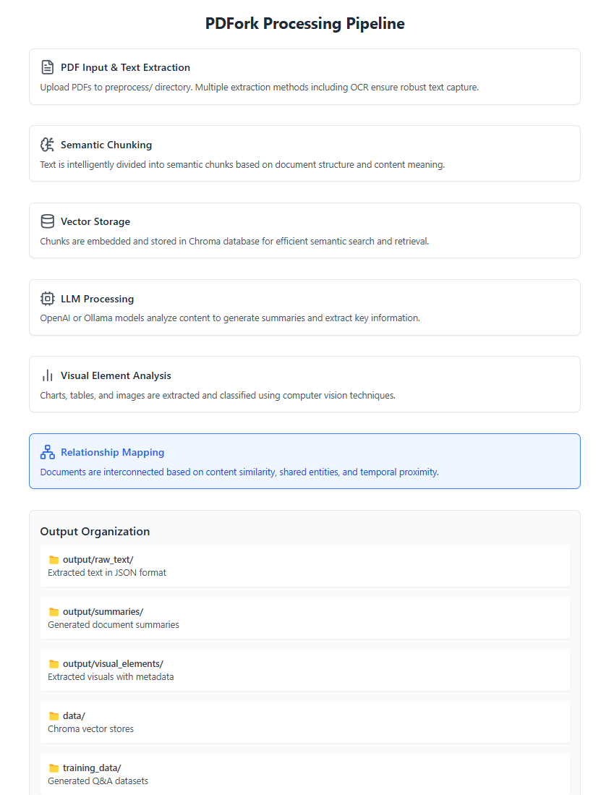
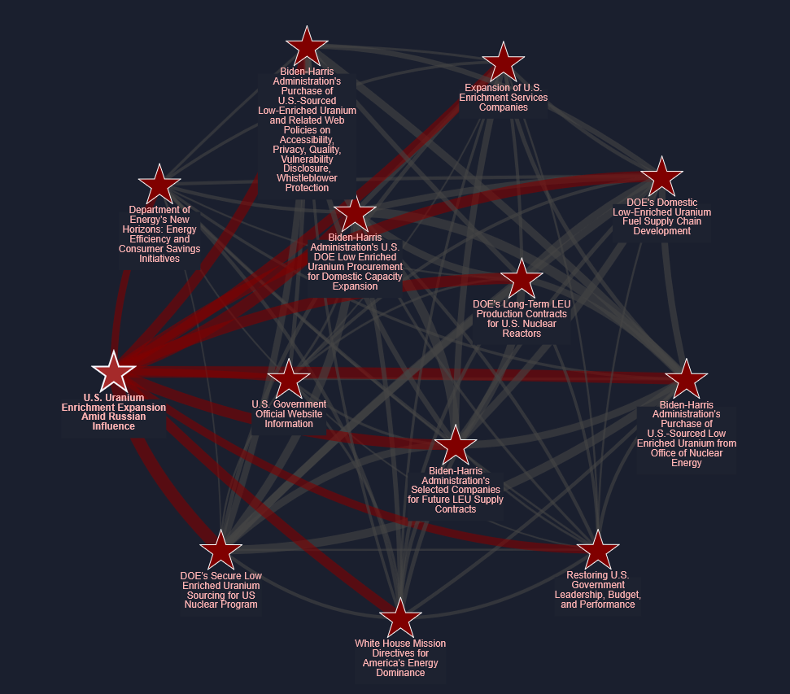
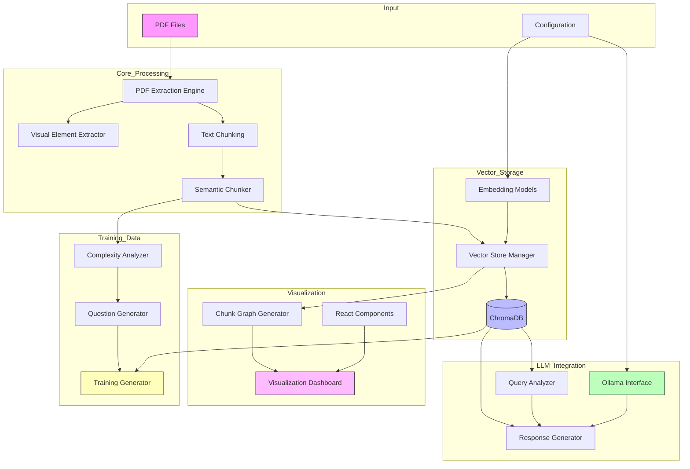
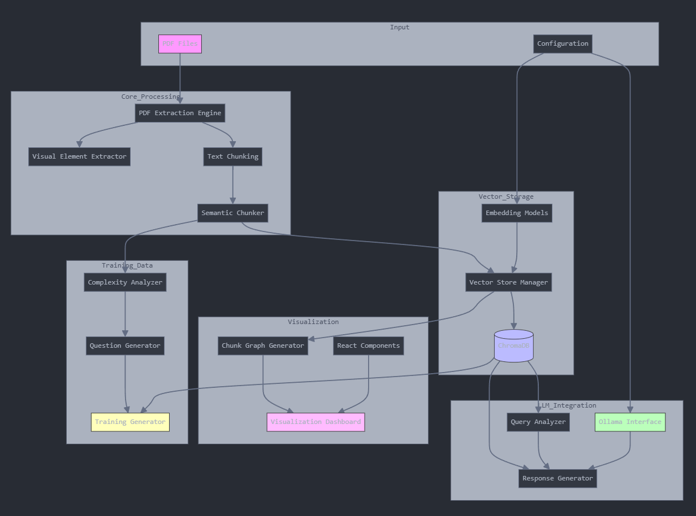

# PDF Processing and Analysis Pipeline

<p align="center">
  
</p>

This project provides a comprehensive PDF processing pipeline that extracts text, visual elements, and enables intelligent conversations with your documents using local LLMs. Chat with your PDFs, generate AI-powered summaries, and visualize document relationships - all while maintaining privacy with offline processing.

<p align="center">
  
</p>

<p align="center">
  
</p>




## System Architecture

<p align="center">
  
</p>

```
Input Layer
├── PDF Files
└── Configuration
    ├──> Core Processing
    │    ├── PDF Extraction Engine
    │    ├── Text Chunking
    │    ├── Visual Element Extractor
    │    └── Semantic Chunker
    │         │
    └──> Vector Storage
         ├── ChromaDB
         ├── Vector Store Manager
         └── Embedding Models
              │
              v
        LLM Integration
        ├── Ollama Interface
        ├── Query Analyzer
        └── Response Generator
             │
        +----|--------------------+
        │    │    │               │
        v    v    v               v
    Training  Visualization    Output
     Data    Dashboard       Storage
```


### Component Description

1. **Input Layer**
   - PDF Files: Source documents for processing
   - Configuration: System settings and model parameters

2. **Core Processing**
   - PDF Extraction Engine: Multi-method text extraction (PyPDF2, PyMuPDF, OCR)
   - Text Chunking: Initial text segmentation
   - Visual Element Extractor: Images, charts, and tables detection
   - Semantic Chunker: Content-aware text segmentation

3. **Vector Storage**
   - ChromaDB: Vector database backend
   - Vector Store Manager: Handles embedding storage and retrieval
   - Embedding Models: nomic-embed-text and all-minilm

4. **LLM Integration**
   - Ollama Interface: Local LLM management
   - Query Analyzer: Smart query processing
   - Response Generator: Context-aware response creation

5. **Visualization**
   - Visualization Dashboard: React-based UI
   - Chunk Graph Generator: Document relationship visualization
   - React Components: Interactive UI elements

6. **Training Data**
   - Training Generator: QnA dataset creation
   - Complexity Analyzer: Content analysis
   - Question Generator: Dynamic question creation

## Key Capabilities

### 🤖 Chat with Your Documents
- Interactive conversations with PDFs using local LLMs
- Smart query analysis for precise information retrieval
- Multi-document search and cross-referencing
- Context-aware responses with source citations
- Support for both general knowledge and specific data queries

### 📊 Advanced Document Processing
- Text extraction using multiple methods (PyPDF2, PyMuPDF, OCR)
- Visual element extraction (images, charts, tables)
- Document summarization using LLMs
- Semantic chunk visualization and relationship mapping
- GPU acceleration support for faster processing

### 🔍 Enhanced Search & Analysis
- Vector database storage for efficient querying
- Semantic search across multiple documents
- Content-aware chunk relationships
- Interactive visualization of document structure
- Relevance-based result ranking

### 📚 Training Data Generation
- Dynamic QnA dataset creation
- Content complexity analysis
- Importance-based question scaling
- Comprehensive metadata tracking

### 🎨 Interactive Visualizations
- React-based workflow dashboard
- Document chunk relationship graphs
- Pipeline process visualization
- Modern UI with Tailwind CSS

## Features

### Document Processing
- Multi-method text extraction pipeline
  - PyPDF2 for basic text extraction
  - PyMuPDF for advanced layout analysis
  - Tesseract OCR for image-based text
- Intelligent visual element detection
  - Automatic chart/table recognition
  - Image quality enhancement
  - OCR preprocessing
- GPU-accelerated local processing
  - CUDA support for LLMs
  - Parallel processing capabilities
  - Optimized resource utilization

### Vector Search
- ChromaDB vector database integration
- Semantic chunking with relationship preservation
- Multiple embedding model support:
  - nomic-embed-text (primary)
  - all-minilm (fallback)
- Configurable similarity thresholds
- Cross-document search capabilities

### Local LLM Integration
- Ollama-based offline processing
- Multiple model support:
  - mistral (default)
  - llama2
  - mixtral
  - neural-chat
  - codellama
- Customizable inference parameters
- Automatic GPU detection and utilization

### Training Data Generation
- Content-aware complexity analysis
- Dynamic question count adjustment
- Comprehensive metadata tracking
- Versioned dataset management

### Visualization Tools
- Interactive chunk relationship graphs
- React-based process dashboard
- Directory structure visualization
- Real-time processing status

## Prerequisites

- Python 3.8 or higher
- Tesseract OCR installed on your system
  - Windows: Download from https://github.com/UB-Mannheim/tesseract/wiki
  - Linux: `sudo apt-get install tesseract-ocr`
  - macOS: `brew install tesseract`
- For local LLM support:
  - Ollama installed (https://ollama.ai)
  - CUDA-capable GPU (recommended for better performance)

## Installation

1. Create and activate a virtual environment:
```bash
python -m venv venv
# Windows
venv\Scripts\activate
# Unix/macOS
source venv/bin/activate
```

2. Install dependencies:
```bash
pip install -r requirements.txt
```

3. Configure your AI provider:

For OpenAI:
- Create a `.env` file with your API key:
```
OPENAI_API_KEY=your_key_here
```

For Ollama:
- Install Ollama from https://ollama.ai
- Check available models:
```bash
ollama list  # List downloaded models
ollama pull mistral  # Download mistral model
ollama pull nomic-embed-text  # Download embedding model
```

### Managing Ollama Models

1. List all downloaded models:
```bash
ollama list
```

2. Search available models:
```bash
# View all available models
ollama pull --list

# Search for specific models
ollama pull --list | grep llama
```

3. Common models for this project:
- Text Generation:
  - `mistral` - Good balance of speed and quality
  - `llama2` - Meta's LLaMA 2 model
  - `mixtral` - Larger, more capable model
  - `neural-chat` - Optimized for conversation
  - `codellama` - Specialized for code understanding
- Embeddings:
  - `nomic-embed-text` - Optimized for text embeddings
  - `all-minilm` - Lightweight alternative

4. Remove unused models:
```bash
ollama rm model-name
```

5. Get model information:
```bash
ollama info model-name
```

### Verifying GPU Usage

1. Check GPU availability:
```bash
nvidia-smi  # For NVIDIA GPUs
```

2. Verify Ollama GPU usage:
```bash
# While running a model, check GPU utilization
nvidia-smi -l 1  # Updates every 1 second
```

3. Enable GPU in Ollama:
- Windows: Edit `%LOCALAPPDATA%\ollama\config.yaml`
- Linux: Edit `~/.ollama/config.yaml`
- macOS: Edit `~/.ollama/config.yaml`

Add or modify:
```yaml
gpu: true
cuda: true  # For NVIDIA GPUs
```

4. Verify model is using GPU:
```bash
# Test GPU usage with a simple query
ollama run mistral "Hello, are you using the GPU?"
# You should see GPU memory usage in nvidia-smi
```

5. Common GPU issues:
- If GPU memory is insufficient, try:
  - Using a smaller model (e.g., mistral instead of mixtral)
  - Reducing the number of concurrent tasks
  - Closing other GPU-intensive applications
- If GPU is not detected:
  - Ensure NVIDIA drivers are up to date
  - Check CUDA installation
  - Verify Ollama has GPU access permissions

Note: The script already configures Ollama to use GPU through these parameters:
```python
num_gpu=1  # In get_llm() and get_embeddings()
```

4. For visualization dashboard (optional):
```bash
# Navigate to viz-test directory
cd viz-test

# Install dependencies
npm install

# Start development server
npm run dev
```

## Directory Structure

- `preprocess/`: Place PDF files here for processing
- `finished/`: Processed PDFs are moved here
- `output/`: Contains processed data
  - `raw_text/`: Extracted text in JSON format
  - `summaries/`: Generated document summaries
  - `visual_elements/`: Extracted images and charts
  - `vector_stores/`: Vector embeddings for document querying
- `training_data/`: Generated QnA training datasets
  - Contains JSON files with question-answer pairs
  - Includes metadata about generation process
  - One file per processed document
- `viz-test/`: Interactive workflow visualization
  - React-based dashboard
  - Tailwind CSS styling
  - Pipeline visualization components

## Visualization Dashboard

The project includes an interactive visualization dashboard built with React and Tailwind CSS that helps users understand the PDF processing pipeline.

### Features
- Interactive workflow diagram showing each processing step
- Detailed explanations of each pipeline component
- Visual representation of the output directory structure
- Modern, responsive design with Tailwind CSS
- Click-to-learn functionality for each processing step

### Running the Dashboard
```bash
cd viz-test
npm run dev
```

The dashboard will be available at `http://localhost:5173` by default.

### Dashboard Components
- PDForkWorkflow: Main workflow visualization component
- Step-by-step process explanation
- Directory structure visualization
- Interactive tooltips and descriptions

### Technology Stack
- React for UI components
- Vite for build tooling
- Tailwind CSS for styling
- Lucide React for icons
- Modern ES6+ JavaScript

## Usage

1. Place PDF files in the `preprocess` directory

2. Run the processing script with your preferred AI provider:

Using OpenAI (default):
```bash
python PDFLCEmbed.py
# or explicitly
python PDFLCEmbed.py --provider openai
```

Using Ollama (local LLM):
```bash
python PDFLCEmbed.py --provider ollama
# Specify a different model
python PDFLCEmbed.py --provider ollama --model llama2
```

The script will:
- Extract text and visual elements from each PDF
- Generate summaries using the specified LLM
- Create searchable vector embeddings
- Move processed files to the `finished` directory

### Querying Documents

After processing, you can interactively query your documents using the local LLM:

```bash
# Query a specific document
python PDFLCEmbed_semantchunk_mapper.py --provider ollama --model mistral --query --doc-id "your_document_id"

# Query across all processed documents
python PDFLCEmbed_semantchunk_mapper.py --provider ollama --model mistral --query
```

The query mode provides:
- Interactive chat interface with your documents
- Two-stage response generation:
  1. Initial attempt using LLM's knowledge
  2. Document search if specific data is needed
- Context-aware responses with source citations
- Support for follow-up questions

#### Query Features

1. Smart Query Analysis:
   - Automatically detects when to search documents
   - Recognizes requests for specific data or statistics
   - Identifies questions about particular entities or time periods
   - Handles comparative questions across documents

2. Document Search:
   - Semantic search across document chunks
   - Relevance-based result ranking
   - Multiple document context integration
   - Source document attribution

3. Response Generation:
   - Combines LLM knowledge with document facts
   - Provides precise citations when using document data
   - Maintains conversation context
   - Handles clarifying questions

Example Queries:
```bash
> What is the general concept of nuclear enrichment?
# LLM provides general knowledge response

> What was Mexico's nuclear capacity in 2023?
# LLM searches documents for specific data

> Compare the nuclear policies of different countries mentioned in the documents.
# LLM analyzes across multiple documents
```

#### Query Best Practices

1. For Specific Data:
   - Include specific terms, dates, or numbers in your question
   - Mention document sections if known
   - Ask for comparisons or trends

2. For General Information:
   - Start with broad questions
   - Use follow-up questions for details
   - Ask for explanations or definitions

3. For Multiple Documents:
   - Specify document IDs if targeting specific documents
   - Use comparative questions to analyze across documents
   - Ask for synthesis of information from different sources

### Generating Training Data

After processing PDFs, you can generate QnA training data using:

```bash
# Process all documents
python generate_training_data.py --provider openai

# Process a specific document
python generate_training_data.py --doc-id "your_doc_id" --provider openai

# Use Ollama with a specific model
python generate_training_data.py --provider ollama --model mistral
```

The script will:
- Analyze content complexity and importance
- Generate appropriate number of questions per chunk
- Create detailed answers from content
- Save comprehensive JSON datasets

#### Dynamic Question Generation

The number of questions generated per content chunk is determined by:
1. Content Complexity Factors:
   - Word count (base: 1 question per ~200 words)
   - Lexical density (unique words ratio)
   - Technical term frequency
   - Numerical content density

2. Content Importance Factors:
   - Key findings/conclusions
   - New concept introduction
   - Statistical content
   - Critical arguments

3. Adjustments:
   - Minimum: 2 questions per chunk
   - Maximum: 15 questions per chunk
   - Importance multiplier: -20% to +20%

#### Output Format

Generated training data is saved in JSON format:
```json
{
    "document_id": "doc_name",
    "total_pairs": 50,
    "total_chunks": 10,
    "average_questions_per_chunk": 5.0,
    "generated_at": "2024-03-14T12:00:00",
    "provider": "openai",
    "model": "gpt-3.5-turbo",
    "training_pairs": [
        {
            "question": "What is...",
            "answer": "The detailed answer...",
            "metadata": {
                "source_doc": "doc_name",
                "chunk_index": 1,
                "chunk_length": 500,
                "generated_questions": 5,
                "generated_at": "2024-03-14T12:00:00"
            }
        }
    ]
}
```

#### Training Data Storage

The generated QnA datasets are stored in the `training_data/` directory with the following organization:

1. File Naming Convention:
   ```
   training_data/
   ├── {document_id}_training_data.json     # Main training data file
   ├── {document_id}_metadata.json          # Additional metadata (if any)
   └── {document_id}_training_data_{timestamp}.json  # Versioned backups
   ```

2. Storage Structure:
   - Each document gets its own JSON file
   - Files are named after the source document ID
   - Timestamps are added for versioned generations
   - Example: `DUKES_2024_Chapter_5_training_data.json`

3. File Organization:
   ```
   training_data/
   ├── Document1_training_data.json
   ├── Document1_metadata.json
   ├── Document2_training_data.json
   └── Document2_metadata.json
   ```

4. Data Persistence:
   - Files are stored in plain JSON format for easy access
   - Each generation creates a new file if one exists
   - Previous versions are preserved with timestamps
   - Metadata files track generation history

5. Accessing the Data:
   - Files can be loaded using standard JSON tools
   - Example Python code:
   ```python
   import json
   
   # Load training data
   with open('training_data/document_name_training_data.json', 'r') as f:
       training_data = json.load(f)
   
   # Access Q&A pairs
   for pair in training_data['training_pairs']:
       question = pair['question']
       answer = pair['answer']
       metadata = pair['metadata']
   ```

6. Data Backup:
   - Keep the `training_data/` directory backed up
   - Version control recommended for tracking changes
   - Consider archiving older versions periodically

### Chunk Visualization

The project now includes an interactive visualization tool for document chunks and their relationships:

```bash
# Generate chunk visualization for a specific document
python visualize_chunk_relationships.py --doc your_document_id
```

<p align="center">
  
</p>

#### Visualization Features
- Interactive HTML-based visualization using pyvis
- Node-based representation of document chunks
- Edge connections showing semantic relationships
- Dark blue theme for better readability
- Zoom and drag functionality

#### Node Information
- Star-shaped nodes represent document chunks
- Node size indicates chunk length
- Node color indicates section level
- Hover text shows:
  - Main topic
  - Content preview
  - Extracted entities
  - Key terms

#### Edge Information
- Edge thickness shows similarity strength
- Edge color changes on node selection
- Hover text displays:
  - Similarity score
  - Shared topics between chunks
  - Relationship type

#### Interactive Features
- Click nodes to highlight connections
- Drag nodes to explore relationships
- Zoom in/out for detail
- Hover for content preview
- Filter by similarity threshold

#### Customization Options
```python
# Example: Customize visualization parameters
visualizer = ChunkVisualizer(provider="ollama", model_name="nomic-embed-text")
visualizer.create_visualization(
    doc_id="your_document",
    output_file="custom_visualization.html",
    threshold=0.5  # Adjust similarity threshold
)
```

The visualization helps in:
- Understanding document structure
- Identifying related content
- Analyzing topic distribution
- Validating chunk coherence
- Exploring semantic connections

## Performance Notes

### OpenAI
- Faster for small batches
- Requires internet connection
- Incurs API costs
- Consistent quality

### Ollama (Local)
- Better for large batches
- Works offline
- Free to use
- GPU acceleration available
- Quality depends on chosen model
- Higher resource usage

### Training Data Generation

- Processing time varies with content complexity
- OpenAI:
  - Faster for small datasets
  - Higher cost per question
  - More consistent quality
- Ollama:
  - Better for large datasets
  - Lower cost (local processing)
  - Quality depends on model
  - Can utilize GPU for faster processing

## Error Handling

- The script includes comprehensive error handling for PDF processing
- Failed files will remain in the `preprocess` directory
- Check console output for detailed error messages

## Notes

- Large PDFs may take longer to process due to OCR and LLM operations
- Ensure sufficient disk space for vector stores and extracted elements
- When using Ollama, first batch may be slower due to model loading
- GPU memory usage varies by model size
- Training data generation is content-aware and adaptive
- Complex or important sections receive more detailed coverage
- Generated questions aim for diverse types (factual, analytical, relational)
- Metadata tracking enables dataset quality analysis
